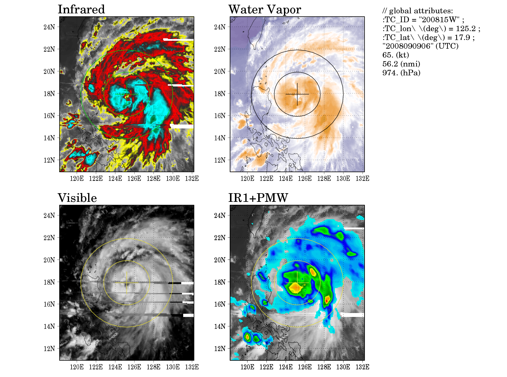
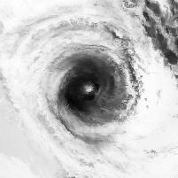
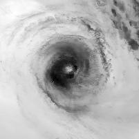
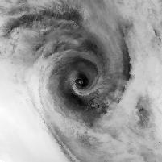
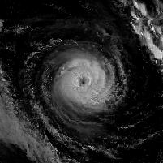
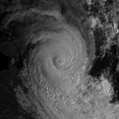
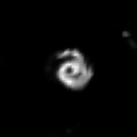
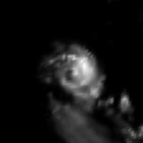

# TCIR
TCIR is a dataset "Tropical Cyclone for Image-to-intensity Regression", collecting tropical cyclone data from satellites including 4 channels.

To let people to conveniently start investigating this kind of tasks, Tropical Cyclone for Image-to-intensity Regression (TCIR) dataset is introduced. It is expected to serve as a benchmark dataset for data scientists to evaluate TC intensity estimation and compare everyone's result fairly.


# Data Size
Including several sets of tropical cyclones from different regions.

| Region | #TCs | #Frames |
| ------ | ------ | ------ |
| Atlantic | 235 | 13707 |
| West Pacific | 379 | 20061 |
| East Pacific | 247 | 13615 |
| Central Pacific | 19 | 1479 |
| Indian Ocean | 75 | 3205 |
| Southern Hemisphere | 330 | 18434 |
| Total | 1285 | 70501 |

# Frames
- 4 channel : 
    - IR1 : Infrared.
    - 
    - WV : Water vapor.
    - 
    - VIS : Visible. Noted that visible channel is very unstable because of the daylight.
    - 
    - PMW : Passive micro wave.
    - 
- Frame size
    - Tropical cyclone’s center is placed in the middle of the vector.
    - A radius of 7 degrees in both Latitude and longitude.
    - 201 x 201 data point
    - Distance between two data point = 14 degree/200 = about 4 Km 
    - Resolution: 7/100 degree lat/lon
    - There exist some missing value, now filled with NaN. These values should be handle in some way such as:
        - Interpolation.
        - Replace by zeros.
        - etc.
    - The original resolution of the PMW channel from CMORPH is 1/4 degree lat/lon, to unify the size of all 4 channels, we scale PMW channel about 4 times larger by linear interpolation.

# Sources
Satellite observations comprising TCIR are from two open sources:
- [GridSat](https://www.ncdc.noaa.gov/gridsat/): a long-term dataset of global infrared window brightness temperatures, including three channels: IR1, WV, and VIS. This dataset includes data from most meteorological geostationary satellites every three hours since 1981. The resolution is 7/100 degree latitude/longitude.
- [CMORPH](http://www.cpc.ncep.noaa.gov/products/janowiak/cmorph_description.html): CMORPH precipitation rates from 2003 to 2016 were included into the TCIR. CMORPH provides global precipitation analyses at relatively high spatial and temporal resolution, which uses precipitation estimates derived from low orbit microwave satellite observations exclusively and whose features are transported via spatial propagation information obtained entirely from geostationary satellite IR1 data. The resolution of CMORPH is 0.25-degree every three hours.

# Labels
We used the best-tracks from Joint Typhoon Warning Center (JTWC) for TCs in western North Pacific (WP); and the best-tracks from the revised Atlantic hurricane database (HURDAT2) for TCs in eastern North Pacific (EP) and Atlantic Ocean (AL) from 2003 to 2016. 

The TC information provided in TCIR includes:
- Intensity, (i.e., the maximum sustained wind, in knots, the main target we want to learn)
- Size (i.e., the mean of radii of 35-knot wind in the four quadrants, in nmi).
- Minimum sea-level pressure
- TC center location

Note that these values are tuned and finalized afterward based on all observation that is available, thus they are very different from the real-time estimations in meaning.

We should keep in mind that although the best-track information can be taken as ground truth, they are still estimations but not the in-situ observation. An estimation of TC intensity might be acceptable if the error is within 10 (knots).

In addition to the intensity, we also provided another remarkable TC structure parameter, the size. TC size is also closely related to the impacts on the economy/society from a TC. As the estimation of size is definitely a valuable task to do in the future, the size is included in the dataset.

# Usage
We provide a HDF5 format file for people to easily access the whole orgnized dataset.
- Dependencies: Python, pandas, numpy, HDF5 packages(such as "h5py").
- Link: [Here](https://learner.csie.ntu.edu.tw/~boyochen/TCIR/)
    - Six region are divided into 2 file:
        - ATLN/EPAC/WPAC
        - CPAC/IO/SH (Notice that TCs from SH, comparing to other regions, rotate in diffrent direction.)
- There are 2 keys in the HDF5:
    - matrix: N x 201 x 201 x 4 HDF5 dataset. One can load this with python numpy.
    - info: HDF5 group. One can load this with python package pandas.

Example: Loading TCIR dataset with python.
```sh
import numpy as np
import pandas as pd
import h5py

data_path = "TCIR.h5"

# load "info" as pandas dataframe
data_info = pd.read_hdf(data_path, key="info", mode='r')

# load "matrix" as numpy ndarray, this could take longer times
with h5py.File(data_path, 'r') as hf:
    data_matrix = hf['matrix'][:]
```

