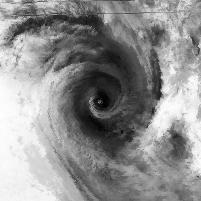

# TCIR
TCIR is a dataset "Tropical Cyclone for Image Recognition Dataset", collecting tropical cyclone data from geosynchronous satellite including 4 channels.


# Data Size
Including three sets of tropical cyclones from three different region.

| Region | Cyclone | Frame |
| ------ | ------ | ------ |
| West Pacific | 320 | 17104 |
| East Pacific | 247 | 14149 |
| Atlantic | 235 | 13707 |
| Total | 802 | 44960 |

# Frames
- 4 channel : 
    - IR1 : Infrared.
    - 
    - WV : Water vapor.
    - 
    - VIS : Visible. Noted that visible channel is very unstable because of the daylight.
    - 
    - PMW : Passive micro wave.
    - 
- From two datasets, both of them are open datasets.
    - IR1, WV, and VIS are from [GridSAT](https://www.ncdc.noaa.gov/gridsat/).
    - PMW rain rate is from [CMORPH](http://www.cpc.ncep.noaa.gov/products/janowiak/cmorph_description.html).  The resolution of this channel is original 56x56
- Frame size
    - Tropical cyclone’s center is placed in the middle of the vector.
    - A radius of 7 degrees in both Latitude and longitude.
    - 201 x 201 data point
    - distance between two data point = 14 degree/200 = about 7 Km
    - There exist some missing value, I filled them by nan. These values should be handle in some way such as:
        - Interpolation.
        - Replace by zeros.
        - etc.

# Labels
- According to the definition, the intensity of tropical cyclone is defined by the wind velocity on the cyclone eye. Such velocity is usually the fastest within the whole cyclone. Therefore, we can also use the maximum velocity within a cyclone to estimate its intensity. 
- For every frame, we provide best track of maximum velocity (Vmax) calculated by [Digital Dvorak](http://journals.ametsoc.org/doi/abs/10.1175/BAMS-87-9-1195), which is refined after the lifecycle of cyclone (comparing to those realtime prediction)
    
# Usage
We provide a HDF5 format file for people to easily access the whole orgnized dataset.
- Link: [Here]()
- There are 2 keys in the HDF5:
    - matrix: 44960 x 201 x 201 x 4 HDF5 dataset. One can load this with python numpy.
    - info: HDF5 group. One can load this with python package pandas.

Example: Loading TCIR dataset with python.
```sh
import numpy as np
import pandas as pd
import h5py

# load "info" as pandas dataframe
data_info = pd.read_hdf("TCIR.h5", key="info", mode='r')

# load "matrix" as numpy ndarray, this could take about 5 min
with h5py.File('TCIR.h5', 'r') as hf:
    data_matrix = hf['matrix'][:]
```

Since the size of original dataset is about 7.3 GB while size of HDF5 file is 28 GB, we provide the original data and also a script for parsing them.
1. Get the original data [TC_data]().
2. Extract [0211_WPACout.tar.gz, 0212_EPACout.tar.gz, 0213_ATLNout.tar.gz] into folder [0211_WPACout, 0212_EPACout, 0213_ATLNout].
3. Run the script "data_parsing.py" written in python2:
```sh
usage: data_parsing.py [-h] path output

positional arguments:
  path        path to the folder 'TC_data'
  output      path to the output hdf5 file

optional arguments:
  -h, --help  show this help message and exit
```


